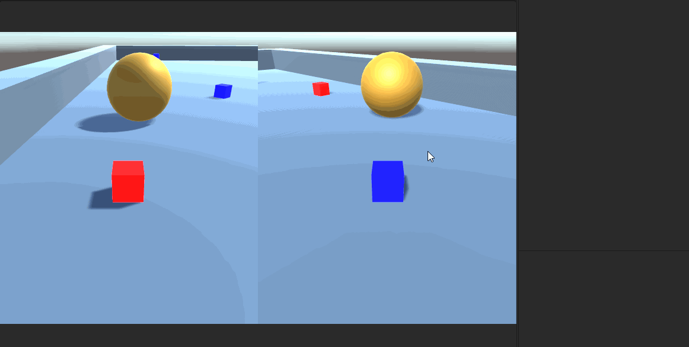
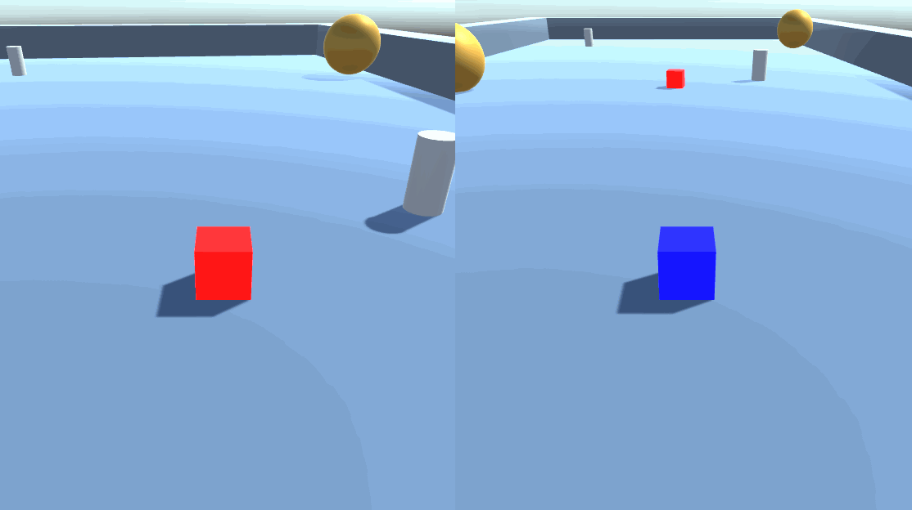
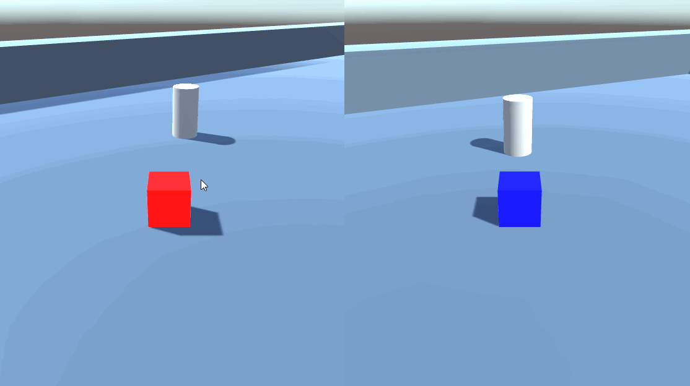

# Práctica 3 - Físicas en Unity

* Cada vez que el objeto jugador colisione con una esfera se debe incrementar un contador. Una de las escenas estará fija, la otra debe estar rodando aleatoriamente por la escena.

> Scripts implementados: `PlayerSquareMovement.cs`, `iniMovement.cs`

Para detectar la colisión, se incrementa un contador en la función __OnCollisionEnter__ si colisiona con un objeto con la tag _“BallObstacle”_

Para que la bola esté rodando aleatoriamente, en cada __FixedUpdate__ le aplicamos una fuerza en una dirección aleatoria con __AddRelativeForce__

______________________________________

* La esfera debe responder a la física. Se deben incluir cilindros que actúen como sensores, de forma que cambian de color cuando el objeto jugador o la esfera estén cerca. Se deben elegir tres tonos de intensidad que se asignarán según el estado de la colisión para cada uno de ellos. Por ejemplo, Ethan 3 tonos de rojo según entre en colisión, siga en colisión o salga de la colisión.

> Scripts implementados: `detector.cs`

A la esfera se le añadió el componente __RigidBody__ para responder a la fisica y añadirle el movimiento aleatorio del anterior apartado. Para los cilindros simplemente dentro de las funciones de colisión modificamos el atributo __material.color__ de su __Renderer__.

______________________________________

* Ubicar un tercer objeto que sea capaz de detectar colisiones y que se mueva con las teclas: I, L, J, M

> Scripts implementados: `PlayerSquareMovement.cs`

Cada script del jugador tiene una variable, `player_number`, que define el número de jugador. Hemos añadido dos jugadores, cada uno con un Input diferente (__wasd__ para el primero, __ijkl__ para el segundo) que se asigna según la variable `player_number`. Además, hemos partido la pantalla de juego para mostrar las dos cámaras a la vez.
